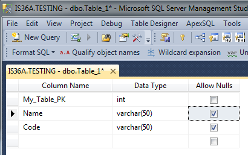
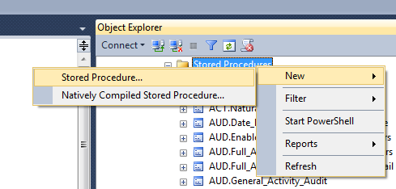
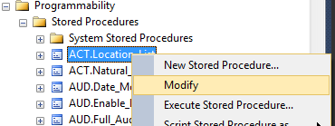

# Basic Usage / Making a change

## Adding a Table

### Previous approach

You could have either used SQL Server Management Studio to use the GUI Table Editor:



or directly run a script to create against your target database:

```SQL
CREATE TABLE dbo.My_Table (
    My_Table_PK INT IDENTITY(1,1) PRIMARY KEY,
    Name VARCHAR(50),
    Code VARCHAR(50)
)
```

### New approach using database migrations

Create a migration script called `#### - Create dbo.My_Table table.sql` and add it to the `up` folder.
Inside this script you would have the same sql code from before:

```SQL
CREATE TABLE dbo.My_Table (
    My_Table_PK INT IDENTITY(1,1) PRIMARY KEY,
    Name VARCHAR(50),
    Code VARCHAR(50)
)
```
This makes sure it will be added to the database when the RoundhousE is run, and we can be sure of the table definition.

## Altering a Table

### Previous approach

Like adding a table, you could have either used the GUI Table Editor, or written a script to apply directly to the target database

### New approach using database migrations

You'll add a migration script called `#### - Alter dbo.My_Table table.sql` to the `up` folder. The script will look something like this:

```SQL
ALTER TABLE dbo.My_Table
ADD Notes VARCHAR(50)
```

Because this script will have been added to the `up` folder after the create script, it will have a greater `####` value and run after the create script. This allows us to ensure that we are altering a table that exists.

## Creating a Stored Procedure

### Before

This was done using SSMS by navigating to the database you wanted to a Stored Procedure to then:
- Programmability
- Right Click on Stored Procedures
- New -> Stored Procedure...



This creates the template of the of file which the developer would edit and then run directly against their target server.

### After

Create a script called `#### - Create dbo.My_Table_List sproc.sql` in the `up` folder.

Edit the file to have contents like this:

```SQL
CREATE PROCEDURE dbo.My_Table_List
AS
SET NOCOUNT ON;
```

Then add a script called `dbo.My_Table_List.sql` to the `sprocs` folder.

Edit the file to have contents like this:

```SQL
-- =============================================
-- Author:      Mark Peterson
-- Case:        0000
-- Create date: 08/16/2016
-- Description: Returns a list of dbo.My_Table.
-- =============================================
ALTER PROCEDURE dbo.My_Table_List
AS
BEGIN
SET NOCOUNT ON;

    SELECT mt.My_Table_PK,
        mt.Name,
        mt.Code,
        mt.Notes
    FROM dbo.My_Table mt

END
```

#### Reasoning

The first part has us create an empty sproc definition to the `up` migration folder this will allow RoundhousE to add the sproc to the database.  This runs before the sprocs folder step.

The second part is the true definition of the sproc.  This can be checked into the repository and changed over time with different commits.  Both of these parts should be commited together (they are one unit of change).

## Altering a Stored Procedure

### Before

Navigating to the Stored Procedure definition in SSMS then Right Click -> Modify



### After

Because we are altering the script we know it will already be in the `sprocs` folder.  All we have to do it edit the correct file and run RoundhousE to apply the change to our target database.

## Creating a View

This is done in the same way as a stored procedure using the `views` folder instead.

## Altering a View

This is done in the same way as a stored procedure using the `views` folder instead.

## Creating a Function

This is done in the same way as a stored procedure using the `functions` folder instead.

## Altering a Function

This is done in the same way as a stored procedure using the `functions` folder instead.

## Running the migration process

The repository will contain a batch file `DBDeployment.bat`.  To run the migrations double click this file or use a shell to `cd` to repository folder and `.\DBDeployment.bat` to run the migration process.

This will target your localhost server and will point to a named database.  For example the `ENTERPRISE` repository will by default target the database called `ENTERPRISE`.

There are a couple of other steps it does automatically for you:

- Determines a version based on the mercurial hash for the repository.
- Determines a repository path.
- Determine the environment (scripts that are only run on certain environments Local/Dev/Test/Prod)
- Updates the RoundhousE schema tables
    - `RoundhousE.ScriptsRun`
        - This contains a list of the scripts that were run and with what version of the database they were applied.
    - `RoundhousE.ScriptsRunErrors`
        - This table contains the errors (if any) that occurred when running the migration and the associated error message.
    - `RoundhousE.Version`
        - This table contains the version of the database that you currently have.  It is matched with the repository hash.

If there are errors they will appear in the `RoundhousE.ScriptsRunErrors` table with the error message.

Once the developer has a working unit of database changes (generally smaller commits are better), and after they've run the RoundhousE then they should make a commit and push to central source control.

***

[Back to table of contents](README.md)
