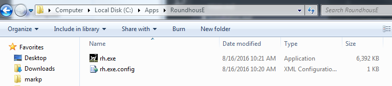
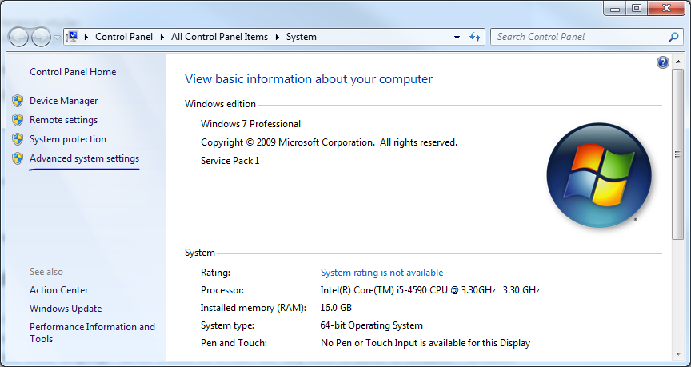
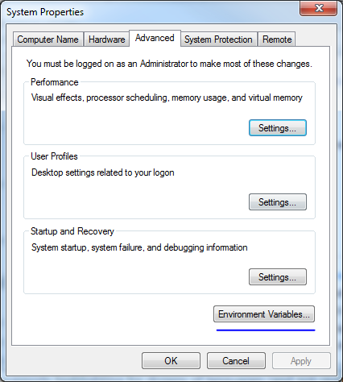
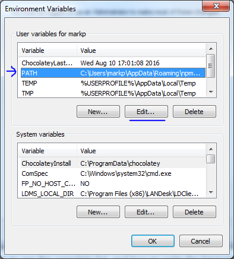
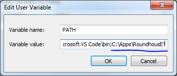
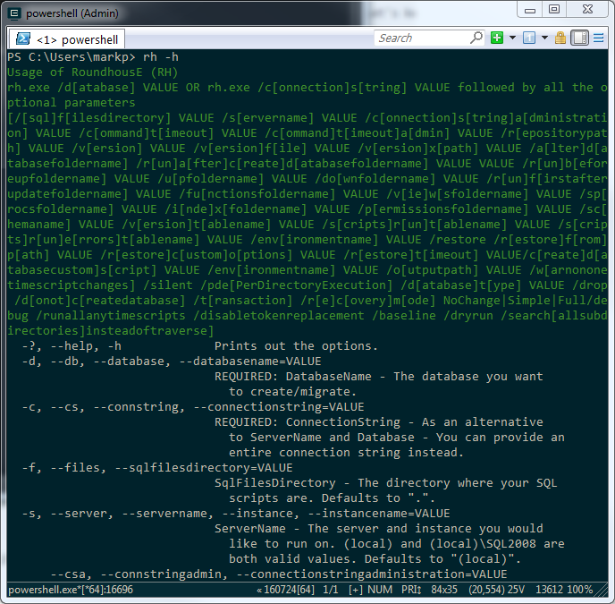

# Installation

The Migration Tool is called [RoundhousE](https://github.com/chucknorris/roundhouse).

The version we are using will be located on the U drive.

1. Copy ```rh.exe``` from ```\\vpinc.net\drives\UserDrive\IT\Software\Development_Tools\RoundhousE``` to your machine and place somewhere safe.
    
    
2. Add it to your PATH.
    1. Computer -> Properties -> Advanced system settings
        
        
    2. Advanced Tab -> Environment Variables... 
        
        
    3. Choose PATH -> Edit...
        
        
    4. Add the folder location of ```rh.exe``` to the path (separated by a semicolon)
        
        
3. Open command prompt or powershell and execute:
    ```cmd
    rh -h
    ```

    
4. You should now have RoundhousE installed locally on your machine and accessible via PATH.

***

[Back to table of contents](README.md)
