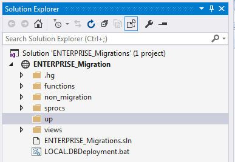

# Developing Database Migration Scripts

## Tools

Visual Studio 2015 was the tool chosen for developing database migrations.
It was chosen to simplify the workflow needed to create the scripts.

These are some of the main benefits that made Visual Studio the tool of choice:

- Like Management Studio, Visual Studio has rich intellisense for both t-sql keywords and contextual database items (schema, table, column, sproc names, etc.).
- Visual Studio allows us to use a project/solution file to keep allow opening them together.  We use a website project type which is a bit of a hack, but the best option for our needs.
    - The website project type is different than the other project types because it respects the filesystem's file / folder location. Other Visual Studio project types use a virtual file directory inside the solution storing it in XML inside the solution while keeping the actual file at the root of the directory, this would cause RoundhousE to skip over them as it only looks in specific folders for files to run.
    - The website solution file uses relative paths, so it doesn't matter where local developers store their database migrations projects.
    - Website solutions allow easy opening by double clicking the solution file, or opening it in the `File > Open Recent Projects and Solutions` menu item.
    - Website solutions allow us to use the Solution Explorer for easy tree view and searching.
    - Using the website solution type means we don't have to do any more configuration on each developer's machine or install any extensions or project templates.
- Visual Studio gives us the option to run scripts against a database instance.
- Visual Studio ensures that our scripts will be encoded as `UTF-8 with BOM`.

## Development Workflow

### Getting Started

#### Get the database migration repositories
Before we begin we need to have need to have the database migration project.
Clone the database migration from the central repository in [Kiln](https://vpidev.kilnhg.com/Code/Repositories#groupsqldb) to your local machine in `C:\Source\sqldb\<database_migrations>`.
The main repositories are:

- [ENTERPRISE_Migrations](https://vpidev.kilnhg.com/Code/Repositories/sqldb/ENTERPRISE_Migrations)
- [VFP_Migrations](https://vpidev.kilnhg.com/Code/Repositories/sqldb/VFP_Migrations)
- [LABELS_Migrations](https://vpidev.kilnhg.com/Code/Repositories/sqldb/LABELS_Migrations)

Once you have them cloned your `C:\Source\sqldb\` folder should look like:

```
C:\Source\sqldb\
                ENTERPRISE_Migrations\
                VFP_Migrations\
                LABELS_Migrations\
```

#### Restore the database to you local machine

We also need to get the trimmed database backup so we have data to develop against.
Database backups are located in the IT Software Folder: `\\vpinc.net\drives\UserDrive\IT\Software\DevelopmentDatabaseBackup`.
The backups we need will be

- `ENTERPRISE_Backup.bak`
- `VFP_Backup.bak`
- `LABELS_Backup.bak`

Copy that to your local machine into your temp folder: `C:\Temp\`

Open Visual Studio 2015.  Open the SQL Server Object Explorer from the View Menu: `View > SQL Server Object Explorer`.


Click the `Add SQL Server` button to launch the `Connect` dialog.

Set `Server Name` to `localhost` and `Database Name` to `master`.  Then hit the `Connect` button.

Make sure the `localhost` connection is selected in SQL Server Object Explorer then hit the `New Query` button.

Paste this script into the new document (but don't run yet):

```sql
ALTER DATABASE [<DatabaseName>] SET SINGLE_USER WITH ROLLBACK AFTER 5
PRINT 'Restoring: <DatabaseName> Database'
RESTORE DATABASE [<DatabaseName>] FROM DISK = N'<DatabaseBackupPath>' WITH FILE = 1, NOUNLOAD, REPLACE, STATS = 10
ALTER DATABASE [<DatabaseName>] SET MULTI_USER
```

Change `<DatabaseName>` to whatever your database name is.  For the current example we will change it to: `ENTERPRISE`.

Then change the `<DatabaseBackupPath>` to the path we copied the backups to and then name of the backup.  For the current example we will change it to: `C:\Temp\ENTERPRISE_2016-08-19_fbb40d232d00.bak`.

The script we can now run will look like this:


Click the green `Execute` button to restore your local database.

Once the these databases are restored we can run the migrations to bring them up to be inline with the central repository.
To do this just run the `Local.DBDeployment.bat` file located in each of the migrations folders.

Our local machine now matches the state of central repository.  We are ready to develop our own database migrations.

### Developing a migration

#### Part 1

Now that our local machine is setup to be inline with central repository we can begin developing a migration.
The following example uses `ENTERPRISE` as the database that will be developed against.

We will open the `C:\Source\sqldb\ENTERPRISE_Migrations\` folder and inside open the `ENTERPRISE_Migrations.sln` file to open the project in Visual Studio 2015.

For this example our task will be to add a table to the database, and a sproc to read the data from the table.
We need this table in place before we continue development on the application.
The table will be called `Product_SKU_Detail` and will be located in the `SaM` schema.
The sproc to read the data will be named `SaM.Product_SKU_Detail_List`.
Neither of these objects currently exist in our database so we will create an `up` script for them.

`up` scripts are scripts that RoundhousE will only ever run a single time so actions that can only happen a single time should go in this folder (things like adding/dropping a table/sproc).  For us we will only ever create a table one time (if we tried to create it again it would error since it already exists).

In Visual Studio's Solution Explorer we should see something similar to this:



Expand the `up` folder and take note of the latest script. So if the latest script is called `0003 - ...` we will call our `up` script `0004 - ...`.

Right click on the `up` folder and `Add > Add New Item...`

In the `Add New Item` dialog select `Text File` and rename to be `0004 - Add SaM.Product_SKU_Detail and related select sproc.sql`. Make sure you change the extension!


Then click `Add` button.  This will add the file to the `up` folder and open the document in the text editor.

Before we start editing it is a good idea to connect the script to your local `ENTERPRISE` instance.
Doing so gives us the database contextual intellisense.
To connect follow these steps:

Click the connect button


This launches the `Connect` dialog in the `Browse` tab. Fill out the dialog like this:

- Server Name: `localhost`
- Authentication: `Windows Authentication`
- Database Name: `ENTERPRISE`

Click `Connect` button.

Now that we are connected to our local `ENTERPRISE` instance we can develop the script.

We will edit the text document to read:

```sql
--Create the Product_SKU_Detail table referencing SaM.Product_SKU
CREATE TABLE SaM.Product_SKU_Detail
(
	Product_SKU_Detail_PK INT IDENTITY(10000, 1) CONSTRAINT PK_SaM_Product_SKU_Detail PRIMARY KEY ,
	Product_SKU_FK        INT NOT NULL CONSTRAINT FK_SaM_Product_SKU_Detail_Product_SKU REFERENCES SaM.Product_SKU (Product_SKU_PK),
	Detail_Name           VARCHAR(50) NOT NULL,
	Detail_Value          VARCHAR(50),
	Date_Modified         DATETIME2(7),
	Date_Created          DATETIME2(7) NOT NULL CONSTRAINT DF_Product_SKU_Detail_Date_Created DEFAULT GETDATE()
)

GO

--Create the empty sproc definition
CREATE PROCEDURE SaM.Product_SKU_Detail_List
AS
BEGIN
    SET NOCOUNT ON;
END
```

This script will create the table and an empty sproc for us to work with for this migration.

We still need to create the real definition of the sproc.  Altering a sproc can happen any number of times so it does not belong in the `up` folder.  We will instead put it in the `sprocs` folder.

Expand the `sprocs` folder in the Solution Explorer and right click on the `SaM` folder to add a new text document like we previously did for the `up` script.
Name this script `SaM.Product_SKU_Detail_List.sql`.

Once it opens in the text editor we will want to connect this to our local `ENTERPRISE` instance like we did for the `up` script.

We can now edit the document to read:

```sql
-- ==================================================
-- Author:      John Doe
-- Create date: 2016-08-25
-- Description: Returns a list of records from SaM.Product_SKU_Detail table.
-- Case:        0000
-- ==================================================

ALTER PROCEDURE SaM.Product_SKU_Detail_List
AS
BEGIN
    SET NOCOUNT ON;

    SELECT Product_SKU_Detail_PK,
        Product_SKU_FK,
        Detail_Name,
        Detail_Value
    FROM SaM.Product_SKU_Detail

END
```

We are now ready to run the migration script.  Due to how RoundhousE is designed it will first run the scripts in the `up` folder that it hasn't run before and then run the scripts in the `sprocs` folder.
This means we know our migration will run the `CREATE TABLE` and `CREATE PROCEDURE` before running the `ALTER PROCEDURE`.

To run RoundhousE we need to run the `LOCAL.DBDeployment.bat` file located in the root of the folder.
We can do this one of two ways.

- Run from Windows Explorer
    1. Open the migration folder in Windows Explorer

        

    2. Double click the `.bat` file to run RoundhousE.

- Configure `.bat` files to start from within Visual Studio (one time configuration).
    1. Open a PowerShell console
    2. Type `Set-ExecutionPolicy RemoteSigned -Scope CurrentUser` and hit enter.
    3. Go back to Visual Studio and Right Click the `LOCAL.DBDeployment.bat` file and select `Open With...`
    4. In the `Open With` dialog hit the `Add...` button.
    5. In the `Add Program` dialog set these values:   
        - Program: `PowerShell.exe`
        - Friendly name: `PowerShell`
    6. Hit `OK` button.
    7. Make sure `PowerShell` is selected and hit `Set as Default` button.
    8. Hit the `OK` button.
    9. Now in the future if you want to run a migration you can just double click the `.bat` file from within Visual Studio's Solution Explorer to run it.

- Configure `.bat` files to start in PowerShell from within Visual Studio (one time configuration).
    

Now that RoundhousE has run against our local without error we can commit the migration to the repository and push our changes to Kiln.
Our commit message will look like:

```
Case 0000 - Add SaM.Product_SKU_Detail table and related select sproc
```

The files we are adding during the commit are:

```
up/0004 - Add SaM.Product_SKU_Detail and related select sproc.sql
sprocs/SaM/SaM.Product_SKU_Detail_List
```

We have now applied the migration to our local database, and pushed it to central source control so others can work with our changes.
We can now continue with application development to work with the new table and sproc we added.

#### Part 2

For this example after deploying the database and application changes there was feedback to add a feature.
The requested feature was to add a `Flag_Active` field on the table we created in the first example.

To implement this change to the database we will need to create another migration.
Before we begin working on the new changes we should do a `pull` from the central source control to see if other developers have added any database migration changes.

Now that our database migrations folder is in sync with central we can begin development.

To add a field to a table we will need an `up` script (we only want to add the field once).

Open the `ENTERPRISE_Migrations` solution and add a new file to the `up` folder like we learned in Part 1.
The name for the example will be `0005 - Alter SaM.Product_SKU_Detail to have Flag_Active field.sql`.

Once added we can connect the script to our local `ENTERPRISE` instance like in Part 1 then edit the script to read:

```sql
-- Add the Flag_Active field
ALTER TABLE SaM.Product_SKU_Detail
ADD Flag_Active BIT
```

Notice that we don't have to do anything to our sproc in this `up` script.
We will edit that next.  Open the `sprocs\SaM` folder and navigate to `SaM.Product_SKU_Detail_List` and open it.
We do this because we are editing an existing sproc definition rather than adding a new one.
Once we connect it to our local `ENTERPRISE` instance we can edit it to read:

```sql
-- ==================================================
-- Author:      John Doe
-- Create date: 2016-08-25
-- Description: Returns a list of records from SaM.Product_SKU_Detail table.
-- Case:        0000
-- 2016-09-25 - 0001 - jd - Added Flag_Active field.
-- ==================================================

ALTER PROCEDURE SaM.Product_SKU_Detail_List
AS
BEGIN
    SET NOCOUNT ON;

    SELECT Product_SKU_Detail_PK,
        Product_SKU_FK,
        Detail_Name,
        Detail_Value,
        Flag_Active
    FROM SaM.Product_SKU_Detail

END
```

We are now ready to run the `LOCAL.DBDeployment.bat` file.
This will apply our changes to our local database.

We can now commit to the repository and push our changes to central source control so other developers can work with our changes.
Our commit message will look like:

```
Case 0001 - Added Flag_Active to SaM.Product_SKU_Detail and related sprocs
```

The files we added/changed are:

```
up/0005 - Alter SaM.Product_SKU_Detail to have Flag_Active field.sql
sprocs/SaM/SaM.Product_SKU_Detail_List.sql
```

## Things to note during development

### File encodings

RoundhousE expects documents to be encoded as `UTF-8 with BOM` using Visual Studio 2015 in the prescribed way in [Development Workflow](#development-workflow) will ensure that documents created are in this encoding.
If files aren't encoded into `UTF-8 with BOM` then RoundhousE has to guess what file encoding it going to run.
RoundhousE was written in .NET and uses the .NET Encoding library to set encodings however without the bit order mark (BOM) it will guess and use the system default.  For a window's machine .NET guess that it is a `Codepage 1252` encoded file.
This will certain characters in our script to be read incorrectly and be applied incorrectly to our database.
For example characters like `°` (Degree Sign) or `á` (a with acute accent) won't encode correctly and will apply the wrong character to the database.

### Linked Servers

When running RoundhousE it applies scripts to the a database.
For local work this isn't an issue because you are apply it to your own machine.
However when one machine targets another and runs RoundhousE there is an issue it runs into with Linked Servers; this is how our automation works.
RoundhousE will fail to run scripts that use a linked server due to a delegation issue (double hop).
Scripts that have a linked server call need to be applied outside of the migration.
Let your dba know if you've added/updated sprocs that contain Linked Server calls so they can apply them to the needed locations.
We still keep these sprocs in the given database migration repository, but they live in a different folder the `non_migration` folder contains a `sproc` folder which should contain sprocs that reference linked servers. 

### Migrations don't go backwards

Application projects in source control are easy to choose any different version and run.
Database Migration projects are different.
It is generally bad practice and inefficient to rollback a database migration.
This doesn't mean that you can't undo those changes though it just means that you have to make a new commit that reverts the functionality.

For example:

Yesterday you made a database migration commit called:

```
Case 0000 - Added Sam.Product_SKU_Detail_Type table
```

New specification means that this was wrong and we don't want the table.
So to correct it we will make a new migration which `drops` the table we added.
We can call this migration:

```
Case 0000 - Removed the SaM.Product_SKU_Detail_Type table
```

This means that if another developer pulls the repo and runs the migrations they will only have to step forward through migrations running the `create` and subsequently running the `drop`.
While RoundhousE has the potential to do reversible migrations it requires more work on the developers part and since they should be infrequent it is easier to do forward-only-development. 

### What constitutes a migration?

Any database changes should be done in a migration, but not all changes should be done together.

Monolithic database migrations are an anti-pattern in database migrations as they provide greater potential for a given migration to fail.
Like application commits generally smaller is better.

In the example in [Development Workflow](#development-workflow) Part 1 you were going to add another page to your application and that page needed a different table to read from.
You might be tempted to roll all those changes into a single migration.
**THIS IS WRONG!** Migrations should be a single chunk of work.
If those tables and related sprocs can function independently from the others then they should be part of their own migration.
Use your best judgement and err on the side of smaller migrations. 

Smaller migration commits have the added benefit of letting other developers get access to the changes you're making quicker so they can work off of them.

A migration should include at most a single `up` script to `create`, `alter`, or `drop` the objects you're working on and should be bundled in the commit with any `sproc` or `view` changes.

Don't go dark.
With database migrations and local development it is important to remember to push and pull changes from central source control frequently to keep other developers aware of the changes you're making and better avoid conflicts.

### RoundhousE Metadata

When RoundhousE runs it will update it's metadata tables.
These tables live on each individual instance and represent what version of database migrations have been run on the server and any errors that have occurred during migrations.
If a database instance doesn't have these tables RoundhousE will automatically add them.
The tables are:

- `RoundhousE.Version`
    - This table contains the central repository path to get changes from, the version of the database that was run against the database (we use the mercurial node hash), and the date it was applied.
    - If the version ends with a `+` then there were uncommitted changes applied during the RoundhousE migration run.  This is ok on a developer's `localhost`, but should not happen on `dev`, `test`, or `prod`.
- `RoundhousE.ScriptsRun`
    - It uses referential integrity back to the version that ran it.
    - This contains a list of the scripts that RoundhousE has run and when it ran the script.
    - It contains the definition of the script that was run, and the hash of the script.  If RoundhousE will check hash a script before running it to see if it has already run (if it has it skips it).
    - If RoundhousE encounters an `up` script with the same file name as one that it has previously run, but the definition is different it will fail the migration.
- `RoundhousE.ScriptsRunErrors`
    - This table doesn't use referential integrity back to the version table due to it needing to log errors that could happen in a transaction.
    - If a migration fails it will be logged here.

These tables shouldn't be updated outside of what RoundhousE does.

***

[Back to table of contents](README.md)
