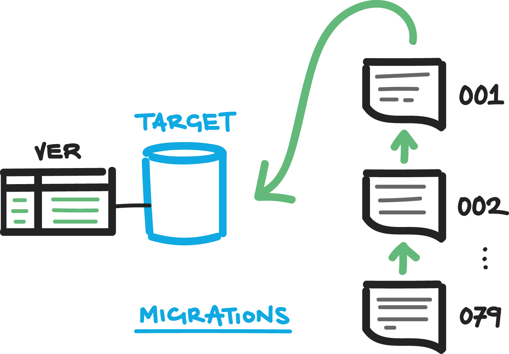

# Migration Theory, Philosophy and Definitions

There are a number of differing approaches to formalizing database changes. Examples include state-based migrations and change script-based migrations. This document will focus on change script-based migrations.

## Terminology 

- Migration - The process of changing a database from one defined version to another.
- Database Version/State - The captured state of a database's structures and the values in its lookup tables.
- Version Metadata - Typically a table in the database itself that captures the database version and keeps track of which scripts have been run for that version.
- Database Build/Change deployment - The act of applying the changes that belong to a given database version. This can be done either by a developer using scripts or a tool, or by an automated process that gets the changes from a central authority (like source control) and applies them using either scripts or a tool.

## Theory

The idea behind implementing a migrations-based approach is to formalize and make repeatable the application of changes to the different instances of the databases (i.e. local, dev, test and prod). In the past, development changes were made directly to the shared development server, this introduced a number of issues:

- Possible loss of changes (e.g. when running an out-of-date `ALTER PROCEDURE` script, effectively overwriting the version on the database) this could happen between developers or when one developer loses track of which version they intend to apply.
- Conflicts with table definitions (i.e. one developer changes a field's width, causing a stored procedure to stop working).
- Difficulty generating a script that reliably combines the changes made to the development server for use in updating the downstream server (test, prod).
- Communication of what changes have been applied to a given database. Without any formal approach, there was no easy way to tell what changes had been applied to test or prod, the best approach was to know what changes you expected applied and to open the object up in SSMS to confirm that the change was made (e.g. open the table designer to confirm that a field width had been increased, or open a stored procedure for modification to verify that the header comments and code matched the expected changes).

(from https://www.simple-talk.com/sql/database-delivery/database-migrations-modifying-existing-databases/)

With a migrations-based approach to making database changes, all changes are made in a prescribed sequence.

The changes are recorded and annotated by using an existing source control solution (in our case, Mercurial), placing the migration scripts into source control allows for: 

- Recording who made a change
- Recording what was changed
- Attaching a global version id to the change (in our case, the Mercurial node hash)
- Incremental development
- Tying application and database states
- Reliable and efficient deploy
- Better concurrent development
- Code reviews
- Keeps track of all files needed for changes better than by hand

Changes made to the DDL (data definition language) or DML (data manipulation language) of a given database are written to a list of immutable text files, by design, only to be run once.

Once changes are made, version metadata is updated to record what changes were run, and what version the database schema is at.

Using a local instance to prepare database changes gives the developer a sandbox to work on changes and get them perfected before making them available to other developers.
A Local sandbox is the same way our application development works. 

## Put into practice 

The Database Migration Tool that we use is called [RoundhousE](https://github.com/chucknorris/roundhouse).
RoundhousE is a script based migration tool which will take a folder full of scripts and run them against a target database instance.
RoundhousE was chosen because it allows us to setup a migration process on our existing databases, requires minimal configuration, and is built using dependencies we already require (.NET).
Moving to database migrations using RoundhousE means that all future development needs to be added via the migrations or it won't be able won't be kept track of in source control.
Using RoundhousE also will simply our deployment process letting, removing the pain of getting a list of scripts together to run against test and production servers.
Smaller changesets allow us to deploy more frequently letting features and fixes get to other developers and end users quicker.

***

[Back to table of contents](README.md)
